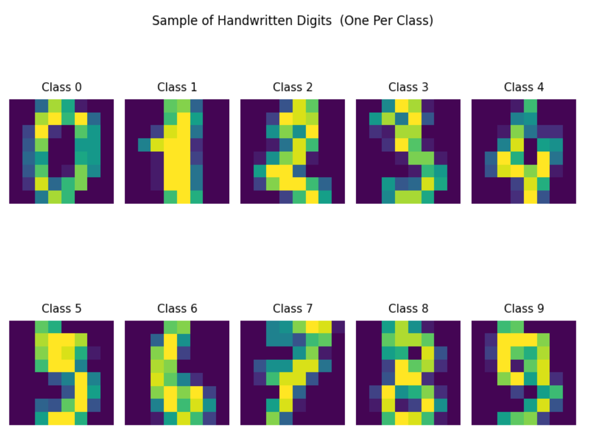
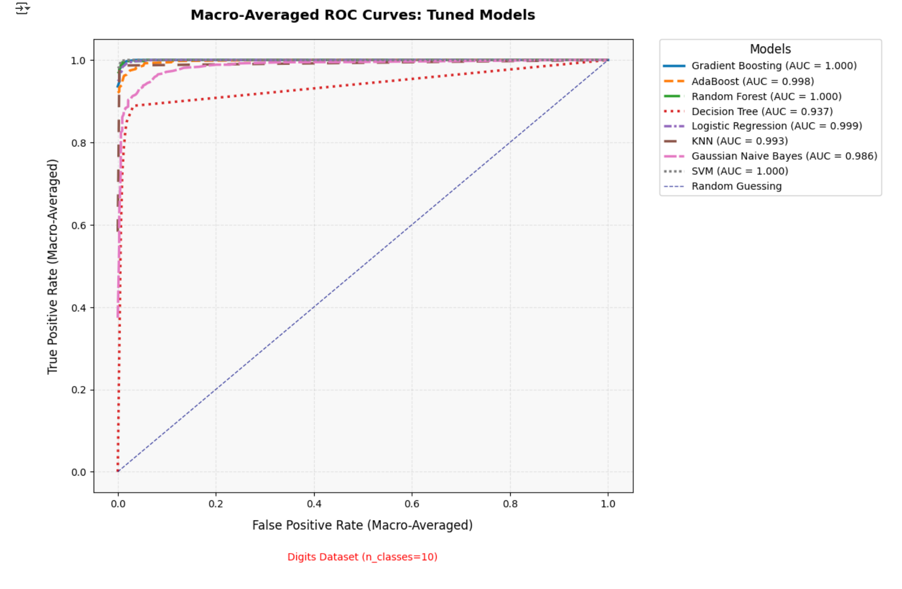
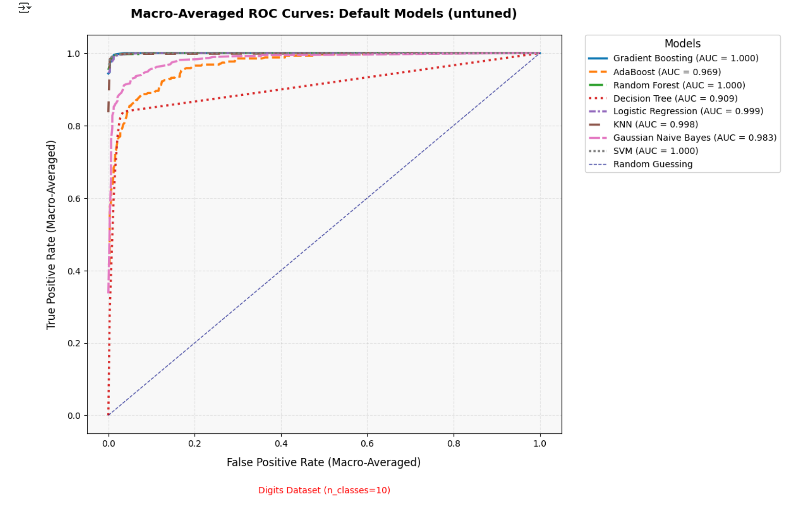
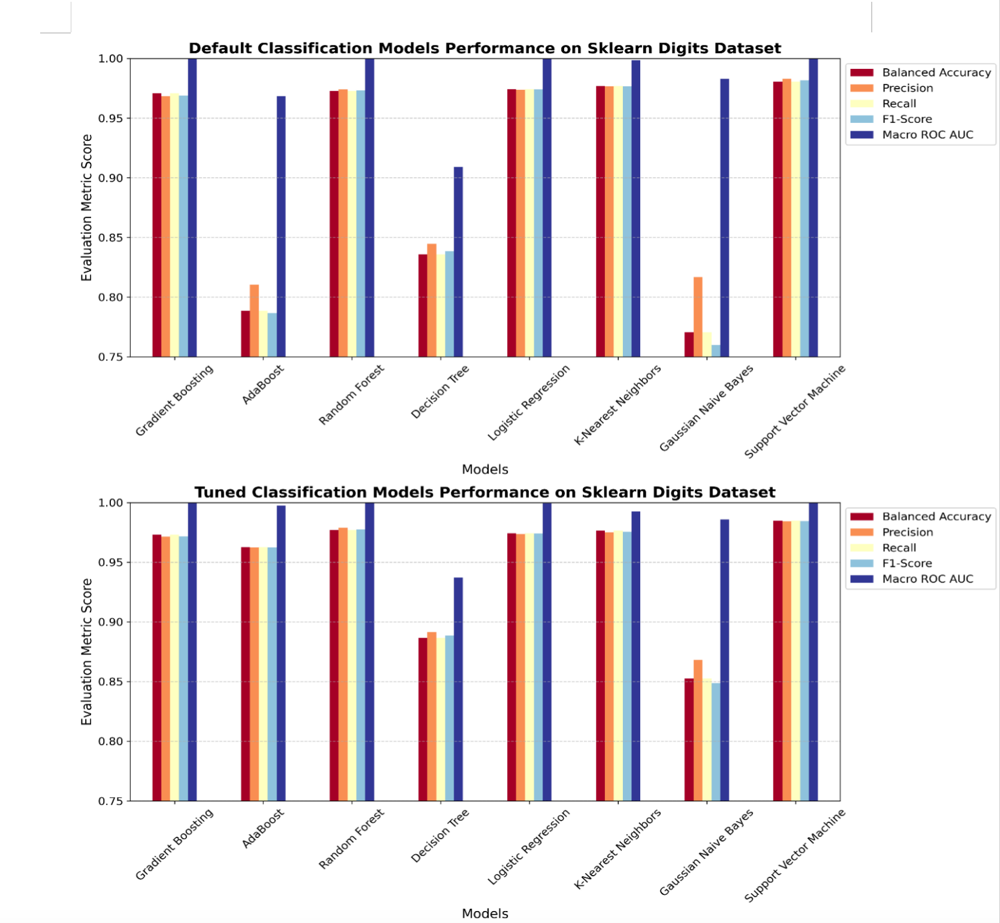

# machine-learning-digits-classification
This project demonstrates a complete end-to-end machine learning workflow for classifying handwritten digits using the **Digits Dataset** from Scikit-learn.



Classification of handwritten digits using classical machine learning methods with model optimization and evaluation on the Scikit-learn Digits dataset


---

##  Project Highlights

- **Dataset**: Digits dataset (8x8 images of handwritten digits 0–9).
- **Techniques**:
  - Data loading, normalization, and preprocessing
  - Training 8 classifiers (default and hyperparameter-tuned)
  - Model evaluation using balanced accuracy, precision, recall, F1-score, ROC AUC
  - Visualizations (ROC curves, confusion matrices)

---

##  Classifiers Used

- Gradient Boosting (Friedman, 2001)
- AdaBoost (Freund & Schapire, 1997)
- Random Forest (Breiman, 2001)
- Decision Tree (Quinlan, 1986)
- Logistic Regression (Cox, 1958)
- K-Nearest Neighbors (Cover & Hart, 1967)
- Gaussian Naive Bayes (Mitchell, 1997)
- Support Vector Machine (Cortes & Vapnik, 1995)

---

## 🛠 Tech Stack

- Python 3.x
- Scikit-learn
- NumPy
- Pandas
- Matplotlib
- Seaborn

---

##  Hyperparameters
Several Hyperparameters were used for model tuning


---

##  Evaluation Metrics

- **Balanced Accuracy**
- **Macro-averaged ROC AUC**
- **Precision, Recall, F1-Score**
- **Confusion Matrices**

Both **default** and **tuned** models were evaluated, and performance was compared visually through consolidated ROC plots.

Example ROC curve visualization:




---

##  Results



---

##  How To Run

1. Clone this repository:
   ```bash
   git clone https://github.com/Lummy-A/machine-learning-digits-classification.git
   cd machine-learning-digits-classification
2. Navigate into the project directory:
   ```bash
   cd digits-classification-ml
3. Set up a virtual environment (optional but recommended):
   ```bash
   python -m venv venv
   source venv/bin/activate  # On Windows, use 'venv\Scripts\activate'
4. Install the required dependencies: Install all the Python libraries listed in the requirements.txt file by running:
   ```bash
   pip install -r requirements.txt
5. Open the Jupyter notebook: Launch Jupyter Notebook to open the project:
   ```bash
   jupyter notebook group_notebook.ipynb
6. Run the notebook:
   Once the notebook opens, run the cells in order to load the data, train the models, and evaluate them.
   The results, including metrics and plots, will appear as you go through the notebook.

**For running in Google Colab (Optional):**
If you prefer not to run it locally and want to try it on Google Colab, just follow these steps:
1. Open Google Colab.
2. Click on File → Open notebook.
3. Select the GitHub tab and enter your repository URL:
https://github.com/Lummy-A/machine-learning-digits-classification
4. Open the notebook from the list and run it just like you would in Jupyter Notebook.

## Collaborators
This project is a collaboration between
- **Lum Apeh Temukum**
- **Sagar Prajapat**
- **Nanditha Suresh Kumar** 
- **Kedar Vishwanath Kalyani**


