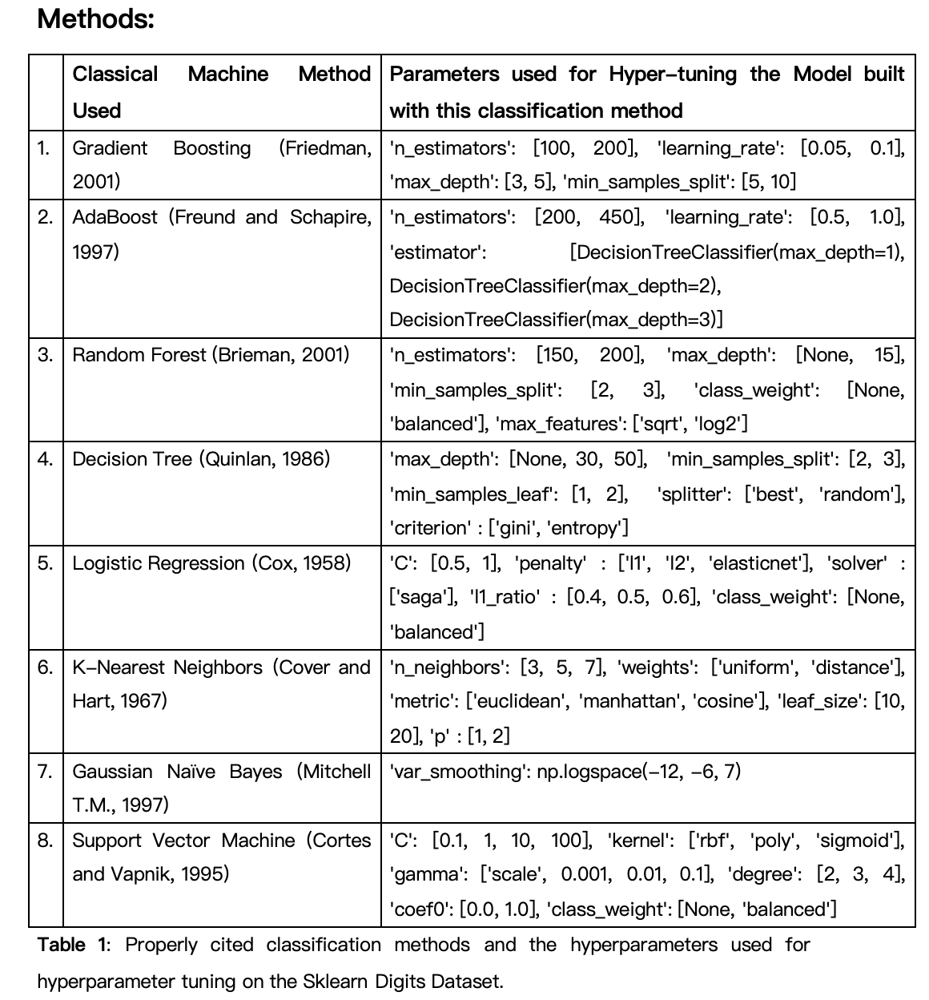

# machine-learning-digits-classification
This project demonstrates a complete end-to-end machine learning workflow for classifying handwritten digits using the **Digits Dataset** from Scikit-learn.


Classification of handwritten digits using classical machine learning methods with model optimization and evaluation on the Scikit-learn Digits dataset


---

##  Project Highlights

- **Dataset**: Digits dataset (8x8 images of handwritten digits 0–9).
- **Techniques**:
  - Data loading, normalization, and preprocessing
  - Training 8 classifiers (default and hyperparameter-tuned)
  - Model evaluation using balanced accuracy, precision, recall, F1-score, ROC AUC
  - Visualizations (ROC curves, confusion matrices)

---

##  Classifiers Used

- Gradient Boosting (Friedman, 2001)
- AdaBoost (Freund & Schapire, 1997)
- Random Forest (Breiman, 2001)
- Decision Tree (Quinlan, 1986)
- Logistic Regression (Cox, 1958)
- K-Nearest Neighbors (Cover & Hart, 1967)
- Gaussian Naive Bayes (Mitchell, 1997)
- Support Vector Machine (Cortes & Vapnik, 1995)

---

## 🛠 Tech Stack

- Python 3.x
- Scikit-learn
- NumPy
- Pandas
- Matplotlib
- Seaborn

---

##  Hyperparameters
Several Hyperparameters were used for model tuning



---

##  Evaluation Metrics

- **Balanced Accuracy**
- **Macro-averaged ROC AUC**
- **Precision, Recall, F1-Score**
- **Confusion Matrices**

Both **default** and **tuned** models were evaluated, and performance was compared visually through consolidated ROC plots.

Example ROC curve visualization:


---

##  Results


The performance evaluation of eight classification models on the Sklearn Digits dataset reveals exceptional results across multiple metrics. Gradient Boosting, Random Forest, Logistic Regression, K-Nearest Neighbors, and Support Vector Machine consistently demonstrated superior performance, achieving balanced accuracy, precision, recall, and F1-scores exceeding 0.97 in their tuned configurations. The comparison between default and tuned models highlights significant improvements through hyperparameter optimization, particularly for AdaBoost, which transformed from one of the lowest performers (0.78-0.81) to one of the strongest (0.96). Decision Trees consistently underperformed relative to other algorithms, while Gaussian Naive Bayes showed moderate improvement after tuning but remained below the top performers.

## Conclusion
These results reinforce several theoretical foundations of machine learning across all tested models. The superior performance of ensemble methods (Gradient Boosting, Random Forest, AdaBoost after tuning) validates the mathematical principles behind boosting (sequential error correction) and bagging (variance reduction through randomized sampling). Support Vector Machine's effectiveness demonstrates its theoretical advantage in finding optimal decision boundaries in high-dimensional spaces, while Logistic Regression's strong performance validates its probabilistic approach to classification despite its relative simplicity. The comparative weakness of Decision Trees highlights their known vulnerability to overfitting without pruning or ensemble techniques. K-Nearest Neighbors' solid results reflect the power of non-parametric, instance-based learning when working with well-clustered data. The relative struggles of Gaussian Naive Bayes illustrate the limitations of its independence assumption between features, particularly problematic for spatially correlated image data. The consistent improvement post-tuning across all algorithms confirms optimization theory's central role in practical machine learning. This comprehensive comparison illustrates how algorithm selection should be guided by understanding both data characteristics and each model's theoretical underpinnings, with tuned parameters bridging the gap between theory and optimal performance.

---

##  How To Run

1. Clone this repository:
   ```bash
   git clone https://github.com/Lummy-A/machine-learning-digits-classification.git
   cd machine-learning-digits-classification
2. Navigate into the project directory:
   ```bash
   cd digits-classification-ml
3. Set up a virtual environment (optional but recommended):
   ```bash
   python -m venv venv
   source venv/bin/activate  # On Windows, use 'venv\Scripts\activate'
4. Install the required dependencies: Install all the Python libraries listed in the requirements.txt file by running:
   ```bash
   pip install -r requirements.txt
5. Open the Jupyter notebook: Launch Jupyter Notebook to open the project:
   ```bash
   jupyter notebook group_notebook.ipynb
6. Run the notebook:
   Once the notebook opens, run the cells in order to load the data, train the models, and evaluate them.
   The results, including metrics and plots, will appear as you go through the notebook.

**For running in Google Colab (Optional):**
If you prefer not to run it locally and want to try it on Google Colab, just follow these steps:
1. Open Google Colab.
2. Click on File → Open notebook.
3. Select the GitHub tab and enter your repository URL:
https://github.com/Lummy-A/machine-learning-digits-classification
4. Open the notebook from the list and run it just like you would in Jupyter Notebook.

## Collaborators
This project is a collaboration between
- **Lum Apeh Temukum**
- **Sagar Prajapat**
- **Nanditha Suresh Kumar** 
- **Kedar Vishwanath Kalyani**

## Contributing

We welcome contributions! If you’d like to help improve this project, follow these steps:

1. Fork this repository.
2. Clone your fork locally.
3. Create a new branch (`git checkout -b feature-branch`).
4. Make your changes and commit (`git commit -m 'Add new feature'`).
5. Push to the branch (`git push origin feature-branch`).
6. Create a new Pull Request.

Feel free to open an issue for any questions, suggestions, or bugs!

## References
This project cites academic papers and textbook references for each classification method, evaluation technique, and model improvement strategies.
(Full reference list is included inside the project folder.)

## Acknowledgement
Generative AI (ChatGPT) was minimally used for minor code optimization suggestions (e.g., improving ROC plot styles and DataFrame indexing).
All main logic, model building, evaluation, and tuning were manually implemented.


